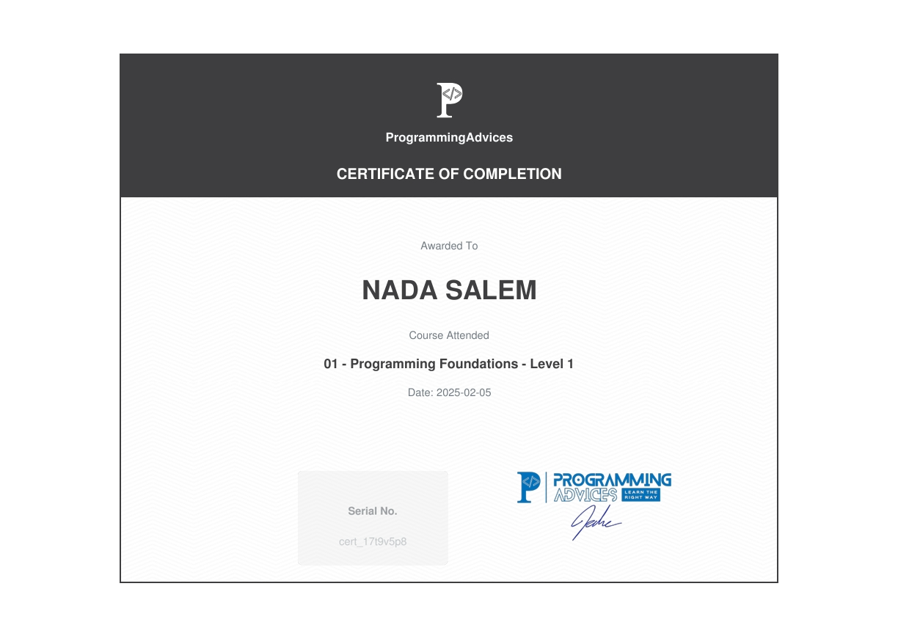

# Programming Foundations - Level 1
This course provided a solid foundation in computer science and programming concepts. I learned the basics of computer systems, binary representation, networks, algorithms, programming languages, and the essential principles every programmer should know before diving deeper into coding.

## Certificate

