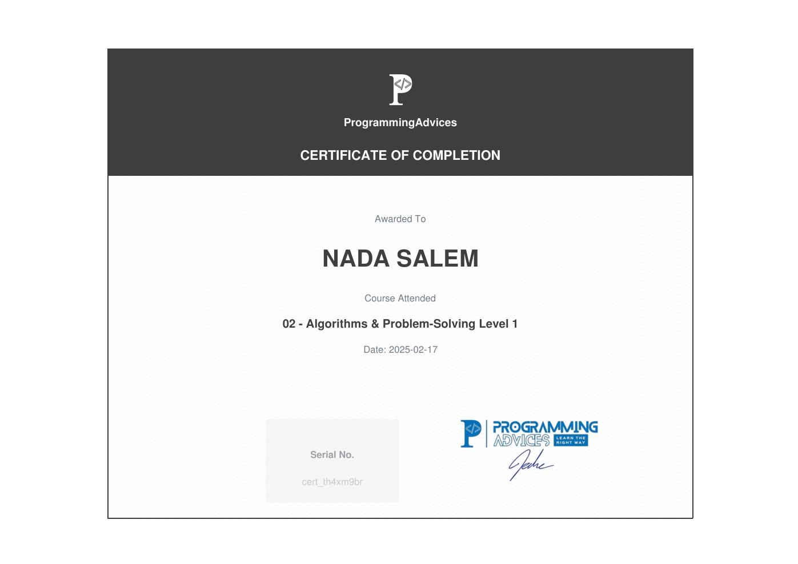

# Algorithms & Problem-Solving Level 1
Through this course, I gained a clear understanding of algorithm fundamentals and enhanced my problem-solving skills by practicing 50 flowchart-based problems.

## Certificate

